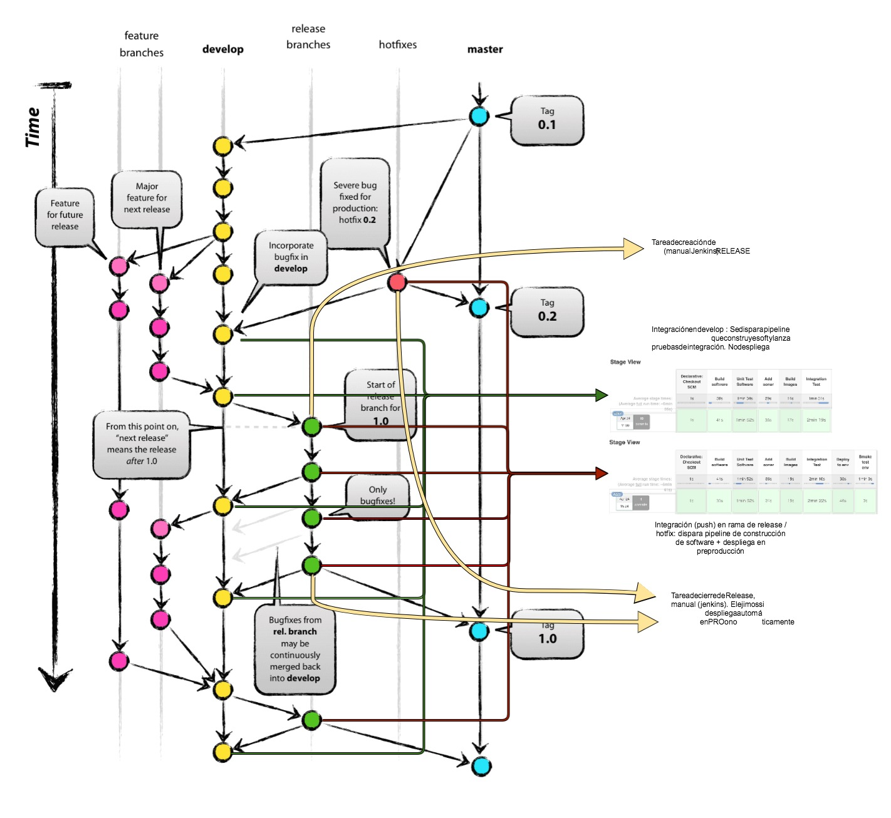

# mngsoftbaseskeleton

Este proyecto pretende facilitar y simplificar el inicio de desarrollo en artefactos destinados a desplegarse en el entorno de Docker de Mango Online.

Para ello ofrece la posbilidad de crear un esqueleto de proyecto maven multimódulo desplegable y apto para entornos preproductivos y productivos así como de un pipeline de CI/CD basado en un modelo de branching GitFlow. Este pipeline es está constituido por:

- Un grupo de scripts para llevar a cabo todos los pasos del ciclo de vida desde la construcción a la puesta en prodcción.
- Un JenkinsFile que orquestra estos pasos .
- Una serie de tareas Jenkins que permitee combniar las herramientas anteriores para automatizar y facilitar las tareas de construcción de software e imágenes docker así como su despliegue en preproducción y posterior promoción a producción.

## RELEASE NOTES

| First Header  | Second Header |
| ------------- | ------------- |
| 2.0.0     | Kubernetes y secrets  |
| 1.0.0     | Deploy to wdpre **** |
| Previous  | Ptroyecots docker, lsdomains  |

## Que no ofrece (¿aún?)
- Creación de un repositorio git inicializado para trabajar con gitflow. 
- Enlazar dicho repositorio Git con las automatiaciones de CI/CD (esto 
 de crear manualmente dos hooks en nuestro repositorio)
- Inyectar de forma automática las tareas Jenkins en un Jenkins no propio (es decir, crear el proyecto desde Jenkins de Sysops y que las tareas se creen el otro Jenkins).
- Secrets de AWS

## notas previaas

Docker en windows y la compartición de unidades:
- https://blog.olandese.nl/2017/05/03/solve-docker-for-windows-error-a-firewall-is-blocking-file-sharing-between-windows-and-the-containers/
- Set-NetConnectionProfile -interfacealias "vEthernet (DockerNAT)" -NetworkCategory Private

## Pipeline ci/cd

Se ofrecen las siguientes tareas automáticas:

- Pipeline de integración. Se dispara con cada push a develop y lanza todos los pasos hasta realizar pruebas de integración.
- Pipeline de PRE. Se dispara con cada push a una rama de release y despliega automáticamente en el entorno de preproducción.

Por otra parte se ofrecen tareas manuales para :

- Crear nueva rama de release / hotfix
- Cerrar rama de release (integra en develop , master y pone tag de versión) sin desplegar.
- Cerrar rama de release (integra en develop , master y pone tag de versión) desplegando en producción.
- Despliegue de una rama en PRE.
- Despliegue de un tag en PRE
- Despliegue de un tag en PRO.

### gitflow

Como hemos comentado con anterioridad este pipeline está pensado, en inicio, para trabajar con un modelo de branching GitFlow (aunque puede ser adaptable a otros modelos de trabajo).

Partiendo de esta base, ofrece las tareas definidas intervienen en los siguientes puntos:

### env_pipeline - options y environments

Se encargará de inicializar el contexto de ejecución. Se lanza desde todos los pasos del pipeline y se encarga de facilitar el contexto de ejecución. Recive dos tipos de parametros:

	-f <option>
	-e <environment>
	
Las 'option' permiten lanzar e inicializar variables que dependen del contexto de ejecución del script, así tenemos_:

	-f jenkins Permite inicializar valores útiles para el contexto de ejecución de JENKINS
	-f devcasa Permite inicializar valores relacionados con el entonro de ejecución en VPN

Por otra parte, los environment, nos permiten establecer el entorno de destino de algunas de las operaciones. No todas las operaciones requieren de este tipo de parámetros, pero pasos como:

	- Deploy en preproducción
	- Ejecución de entorno de integración
	- ...

requieren que se especifiquen estos pasos.

> **IMPORTANTE**
> 	Esto sólo es relevante cuando necesitemos ejecutar alguno de estos pasos desde nuestro entorno local. Al ejecutar el PIPELINE desde Jenkins esto es irrelevante.

### Pasos del pipeline
#### Build
#### Test integración
#### Deploy to PRE
#### Promote to PRO
### Throtle por proyecto
### Variables necesarias

A nivel de ejecución de Pipeline, necesitaremos que se definan las variables:

- CICD_USER
- CICD_PASS

como exportación de credenciales jenkins que se coresponderán con un usuario de LDPA (con permisos en : Jenkins, Git (bitbucket), registry de docker de PRE y PRO ) para poder llevar a cabo las interacciones con otras herramientas.

Por otra parte, a nivel de PIPELINE, se necesita setear estas variables a partir de un usuario valido de Jenkins, por defecto toma valor #jenkins.credentials.id#, pero en el momento de la creación del proyecto se puede modificar.

## En jenkins
Notas: 

https://stackoverflow.com/questions/842

https://groups.google.com/forum/#!topic/jenkinsci-users/rXQAlUDltlo4228/export-import-jobs-in-jenkins

Recuperar xml de carpet:

Java -jar jenkins-cli_mng.jar -s https://#jenkins.credentials.id#:@#jenkins.credentials.id#.mangodev.net/jenkins -noCertificateCheck -remoting list-jobs softbase/Mailgateway | grep mailgateway | while read job; do echo "tratando $job"; java -jar jenkins-cli_mng.jar -s https://#jenkins.credentials.id#:@#jenkins.credentials.id#.mangodev.net/jenkins -noCertificateCheck -remoting get-job softbase/Mailgateway/$job > $job.xml; done
## Esqueleto de aplicacion

### Estructura de aplicación

Hemos diseñado una aplicacion dividida en varios layer. La siguiente tabla define el uso de cada uno de ellos:

|*Nivel*|*módulo*|*uso*|
|------|----|------|
| Datos | dataApi | Define las APIs (iterfaces) de acceso a datos (consumirá la capa de modelo) así como los DTOS que saldrán de esta capa. Se puede optar por usar estos DTOs en la capa de modelo o definir en dicha capa de modelo DTOs de mapeo y crear conversores.   **Clean Architecture - No incluye ningún framework. Java ONLY (más allá de usar tal vez anotaciones de Java Persistence si compartimos dto's con la capa de modelo)**|
| | model | Capa de acceso a datos. Incorpora las dependencias de Spring JPA + Hibernate. Incorpora la dataApi como dependencia y ha de implementar los interfaces definidos en esta. |
| negocio | service | Implementa la lógica de negocio de la aplicaicón sustentándose de la capa de datos y de otras posibles APIs de interacción con el exterior.  **Clean Architecture - No incluye ningún framework. Java ONLY** |
| runtime | restapi | Ofrece la API de la aplicación como servicios rest (u otro tipo). **Incorpora como framework de trabajo Spring (NO SPRINGBOOT).**.   Define **controllers** que se apoyan en la capa de negocio. Podría incorporar los ámbitos necesarios de seguridad.   Implementa BeanProviders que hacen accesibles los diferentes elementos de la capa de Servicio. Hace de orquestrador de todos los elementos que vienen de capas inferiores. |
|  | engine | Implementa las tareas planificadas que correrían en infraestructura middle (no WDPRE) (@schedules). **Incorpora como framework de trabajo Spring (NO SPRINGBOOT).**.   Define controllers que se apoyan en la capa de negocio. Implementa BeanProviders que hacen accesibles los diferentes elementos de la capa de Servicio. Hace de orquestrador de todos los elementos que vienen de capas inferiores.  |
| deploy | restApiApp | Modulo springboot jar que permite publicar la api rest ofertada por la capa restapi.| 
| | engineApp | Modulo springboot jar que permite ejecutar los procesos planificados ofrecidos por la capa engine.| 
| | singleApp | Intenta combinar los dos anteriores y ofertar una única aplicación WAR que contempla tanto API rest como planificaciones | 
|  | batch | Capa que permite implementar servicios del sistema Batch o de tareas que siguen las APIs de procesos planificados de mango Online (WDPRE) |

> **IMPORTANTE**
> se ofrecen varios modos de aplicación que incorporan uno o varios de los desplegables descritos. Se vará más adelante.
> 
> **IMPORTANTE** Las configuraciones no se incorporarán nunca fuera de módulos de deploy. Además, la configuración por entorno se gestionará a través de los stacks docker de despliegue, nunca en ficheros por entorno dentro de los desplebales (salvo casos como la configuración de log por entorno u otro caso indispoensable).

### Tipos de aplicación generada

### Logs aplicacion

Mirar esta info para tenerla en cuenta

[https://jira.mangodev.net/confluence/display/OLTECH/Logs](Propuesta campos)
 
[https://cloud.spring.io/spring-cloud-sleuth/](sleuth)

## Newman

## Jenkinsfile

## Kubernetes

Our approaach to containers deployment is based in k8S, in the implemententation of k8s defined by CAPSIDE for MANGO.

# NOTAS
* En model necesitamos crear una entity falsa, tendras que eliminarla.

# Simple step by step

artefacto a crear : **demodocker**

- Creamos registry

  https://registry.docker.pre.mango.com/  (demodocker) 
  https://registry.docker.pro.mango.com/  (demodocker) 

- Crear proyecto

  https://#jenkins.credentials.id#.mangodev.net/jenkins 
  https://#jenkins.credentials.id#.mangodev.net/jenkins/job/softbase/job/create_softbase_project/

  Datos proyecto
    
      demodocker
      com.meph.demodocker

      Opcional generar tareas jenkins

- Bajamos el ZIP, y descomprimimos

- Construimos y creamos imagenes

      cd build_pipeline
    
      ./01_01_build_software.sh -f devcasa
      
      ./02_docker_build_images.sh -f devcasa

      docker images | grep demodocker

- Pruebas de integración con yml de integracion
    
    ./03_test_integracion.sh -f devcasa
    
    less stack_definitions/config_generada/last_docker_compose_mock_test_integracion.yml

- Deploy to PRE  

    ./04_deploy.sh -f devcasa -e pre -f registrymng_pre

    Nuesto stack en PRE:

        less stack_definitions/config_generada/last_docker_compose_deploy_pre.yml

    verificamos imagenes en:

        https://registry.docker.pre.mango.com/ --> demodocker

    verificamos stack:
        
        https://control.docker.pre.mango.com/manage/dashboard

    Probamos:
    
        http://demodocker.docker.pre.mango.com/info
        http://demodocker.docker.pre.mango.com/health
        
        desde fuera:
        
        https://services.cdn.pre.mango.com/demodocker/info
        https://services.cdn.pre.mango.com/demodocker/health
        
    Echamos un ojo a los logs
    
        https://elastic.mangodev.net/_plugin/kibana/app/kibana#/discover?_g=(refreshInterval:('$$hashKey':'object:1878',display:'5%20seconds',pause:!f,section:1,value:5000),time:(from:now-2m,mode:relative,to:now))&_a=(columns:!('@message'),index:'*-dockerforawspre-*',interval:auto,query:(query_string:(analyze_wildcard:!t,query:'@log_stream:demodocker*')),sort:!('@timestamp',desc))
 

- Promote to PRO

        ./05_promote_from_pre_to_pro.sh -f devcasa -f registrymng_pro -e pro

    Nuesto stack en PRE:

        less stack_definitions/config_generada/last_docker_compose_deploy_pro.yml

    verificamos imagenes en:

        https://registry.docker.pro.mango.com/ --> demodocker

    verificamos stack:
    
        https://control.docker.pro.mango.com/manage/dashboard

    Probamos:
    
        http://demodocker.docker.pro.mango.com/info
        http://demodocker.docker.pro.mango.com/health
